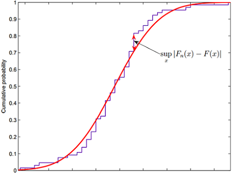

--- 
title: "Predictive Models of English Premier League Goal Scoring"
author: "An Honors Thesis submitted in partial fulfillment of the requirements for graduating with Departmental Honors in Mathematics"
date: "Quang Nguyen <br> Wittenberg University <br> Spring 2020 <br>"
site: bookdown::bookdown_site
output: bookdown::gitbook
documentclass: book
---

# Abstract

The English Premier League is well-known for being not only one of the most-watched football leagues in the world but also one of the toughest competitions to predict. The purpose of this research project was to look at goal scoring data of the English Premier League and use statistical modeling to predict Premier League match results. This research will attempt to determine whether goal scoring in the Premier League can be modeled by a Poisson process, specifically, the relationships between the number of goals and the Poisson distribution, the time between goals and the exponential distribution, and positions of goal data points and the continuous uniform distribution. It turns out to be that the Poisson process and the three families of distributions do perform a great job of describing Premier League goal scoring. In addition to this, various models of predicting a Premier League season's results based on different sets of data will be observed and compared, with a large number of simulations being involved in each method. 

# Introduction

## Topic

### The English Premier League

Association football, also commonly known as soccer in America, is undoubtedly the best sport in the world. Often referred to as the king of sport, football can be played almost anywhere, from grass fields to indoor gyms, streets, parks, or beaches, due to the simplicity in its principal rules and essential equipment. Europe is known to be the birthplace of modern football, and the European soccer culture is unlike any other. The Old Continent is home to numerous top-level professional football leagues, and the English Premier League (EPL) is certainly the best of them all, because of its competition quality, overall balance, and popularity. Some of the best football coaches and players in the world come together to compete for the prestigious Premier League trophy. 

The EPL was founded in 1992, and over the last three decades, we have witnessed numerous memorable matches and countless outstanding performances by clubs and their players. The EPL is currently a competition of twenty English football clubs. At the end of each season, the bottom three teams get relegated to the second-highest division of English football, in exchange for three promoted teams. A Premier League season usually takes place from mid-August to mid-May. Each team gets to play every other team twice, once at home and once on the road, hence there are a total of thirty-eight fixtures in a season for each team.

### Goal Scoring in Football

The most important aspect of the game of football is indisputably scoring goals. Despite the importance of other factors like ball possessing or disciplined defending, we have to admit that the main reason we pay to watch soccer is to see the ball being put in the back of the net. The rule is very simple: in order to win, you must score more than your opponent. In the Premier League, each match happens within the span of 90 minutes (plus stoppage time), and the match consists of two 45-minutes halves. Each team can get one of these three results after each match: a win, a draw, or a loss. If there's a draw, the two clubs receive a point apiece, and for non-drawing matches, the winner is rewarded with three points and the losing team gets punished with zero points. Thus the club with the most points at the end of the year will have their hands on the exquisite EPL trophy, and the total points also determines the fates of teams in the relegation zone. This makes every single match so critical, as losing one tiny single point could end up costing a team's chance of winning a title or remaining in the top tier soccer league in England. 

## Report Overview

<center>


</center>

The structure of this report will be based off of the above diagram of Data Science. Before any analysis, data is first imported from data files and stored in R data frames. Then data cleaning and preparing take place, which then allow us to manipulate, model and produce different visualizations during the process of analysis. After that we must communicate the insights gained from data. Programming is utilized in every step of the data science process, which improves the efficiency of data problem-solving.

# Data Importing and Tidying

The ultimate data file for this project will simply consist of match final scores of all Premier League games from its inaugural competition, the 1992-93 season, to the last fixture of the last completed 38-matchweek contest, 2018-19 season. The 5 main attributes of this dataset are Season, Home Team, Away Team and the number of goals scored by each team.

The following webpage https://www.football-data.co.uk/englandm.php contains all data of premier league matches from 1992 to 2019. Each season has its own data file; every file is in csv format, and they can be saved easily by clicking on the hyperlink associated with each one of them. We downloaded and named the data file for each season by the "starting year" of the season. For example, if the season is 2018-19, the data is saved as ``2018.csv``. This will help us in a later step.

In addition, since we are interested in investigating the relationship between scoring time and the time between goals, data on these two topics for Manchester United, a Premier League club, are collected and stored in a file named ``muscoringtime.xlsx``. More details on this data file will be discussed once we get to the analysis of time between goals.

Before we begin, the following packages are loaded to help us with all stages of this project.

```{r, message=FALSE}
library(tidyverse)
library(kableExtra)
library(mosaic)
library(readxl)
library(surveillance)
library(knitcitations)
```

We also write this function which will later on help us with table formatting.

```{r}
mykable <- function(df){   
  kable(df) %>% 
  kable_styling("striped", full_width = FALSE)
}
```

To load the match results data into R, it is a good idea for us to write an importing function. This function takes in the starting year of the season, reads in the data file from its file path, and performs some table transformations including creating a new column to represent the seasons, renaming and selecting variables that are needed in further steps.

```{r}
epl.season <- function(year){
  epl.path <- paste("data/", year, ".csv", sep = "") # get file path
  epl.Getdata <- read.csv(epl.path) # read in file
  epl.Getdata <- epl.Getdata %>% 
    mutate(Season = paste(year , "-", year + 1, sep = "")) %>% 
    rename(Home.Goals = FTHG, Away.Goals = FTAG) %>% 
    select(Season, HomeTeam, AwayTeam, Home.Goals, Away.Goals) 
}  
```

Now we want to combine all the data from every year into one big data table. To do this, we use a ``for`` loop, which allows us to iterate over the year range, then join the tables together. A ``full_join`` is used here, which is a type of outer join in R. An outer join keeps observations that appear in at least one of the tables, and a full join keeps all observation in the tables.

```{r, warning=FALSE, message=FALSE}
epl.fulldata <- epl.season(1992) # initializes full dataset
for (year in 1993:2018) {
  epl.fulldata <- epl.fulldata %>%
    full_join(epl.season(year))
}
```

Here's a quick glimpse at the last 4 rows of our "mega" data table. 

```{r}
epl.fulldata %>% 
  tail(4) %>%  
  mykable()
```

The data importing is complete; we can now proceed to the analysis stage of the project.

# Goal Scoring and the Poisson Process 

## The Poisson Process

The Poisson process is a randomly determined process used to model the occurrence (or arrival) of phenomena over a continuous interval, which in most cases represents time. There are several characteristics of the Poisson process that can be observed, including, the number of events happening in a given time period; the time between those events; and when (at what point of time) the events occur. Playing a huge role in the Poisson process is the Poisson distribution, which deals with the number of occurrences of an event in a fixed period of time, with a rate of occurrence parameter $\lambda$. Another key distribution in this process is the exponential distribution, which has a strong connection with the Poisson distribution, as if the number of occurrences per interval of time are illustrated by Poisson, then the description of the length of time between occurrences are provided by the exponential distribution. If Poisson events take place on average at the rate of $\lambda$ per unit of time, then the sequence of time between events (or interarrival times) are independent and identically distributed exponential random variables, having mean $\displaystyle \beta = \frac{1}{\lambda}$. Furthermore, there's a relationship between Poisson and another famous probability distribution - the continuous uniform distribution. If a Poisson process contains a finite number of events in a given time interval, then the unordered times, or locations, or positions, or points of time at which those events happen are uniformly distributed on that interval.

We suspect that goal scoring in soccer can be modeled by a Poisson process. According to the characteristics described above, if goal scoring for a club happens at a certain rate in a given time period, then a Poisson distribution can be used to model the number of goals scored. Additionally, the waiting time (usually in minutes) between successive instances of goal can be described using an exponential distribution. Moreover, the positions of time, better known as "minute marks", in a game at which scoring events transpire may be uniformly distributed. We're going to answer these questions in this research. With that goal, we're now moving on to the modeling and analysis phases of this report. 

## Goal Scoring and the Poisson Distribution

### The Poisson Distribution

The Poisson distribution, named for French mathematician Siméon Denis Poisson, is a discrete probability distribution that expresses the number of occurrences of an event over a given period of time. A Poisson random variable can represent many instances in our daily lives such as the number of phone calls coming into the Math Workshop requesting a tutor in a week, the number of misprints in a newspaper, or the number of cars arriving at a fast food drive-through in an hour.

The probability function of a Poisson random variable $X$ with parameter $\lambda$ is given by:
$$\displaystyle p_X(x) = \frac{{e^{ - \lambda } \lambda ^x }}{{x!}} ; \ x = 0,1,2,... \textrm{ and  } \lambda > 0 $$
where $X$ represents the number of occurrences of an event in a given unit time period, and $\lambda$ is the constant rate of occurrence per time period.

The mean and variance of our Poisson Random Variable $X$, denoted by $\mu_X$ and $\sigma^2_X$ respectively, are 
$$\mu_X = \lambda$$ and $$\sigma^2_X = \lambda$$

We wanted to use this idea to model the goal scoring rate for soccer clubs during the Premier League era. 

### Poisson and the Number of Goals Scored 

We use Manchester United (Man Utd), the most successful English club of all time, as our case of inspection. The question here is "Does Man Utd's number of goals scored follow a Poisson distribution?" To answer this question, we first create a table of Man Utd's goals. The table will consist of 2 columns: 1 for how many goals they scored in a match, and 1 for where the match took place - home or away. Therefore, each row of the table represents the number of goals scored in a match and the type of goal. 

```{r}
MUHome <- epl.fulldata %>%   
  filter(HomeTeam == "Man United") %>%  
  select(Home.Goals) %>% 
  mutate(type = "Home") %>% 
  rename(goals = Home.Goals) # rename for joining purposes
```

```{r}
MUAway <- epl.fulldata %>%
  filter(AwayTeam == "Man United") %>% 
  select(Away.Goals) %>% 
  mutate(type = "Away") %>% 
  rename(goals = Away.Goals)
```

We then once again use a ``full_join`` to merge our 2 tables into one table.

```{r}
MUGoals <- full_join(MUHome, MUAway, by = c("goals","type"))
MUGoals %>% 
  head(3) %>% 
  mykable()
```

We now begin our analysis with a simple histogram and some summary statistics of Man Utd's goals.

```{r}
MUGoals %>% 
  ggplot(aes(x = goals)) +
  geom_histogram(color = "darkgreen", fill = "lightgreen", bins = 10) +
  scale_x_continuous(breaks= 0:9)
```

```{r}
fav_stats(MUGoals$goals) %>% 
  mykable()
```

We now take a look at the mean and variance (the square of the standard deviation) of Man Utd's scoring rate. We are hoping to see these two values to be equal, since we know that the mean and variance of a Poisson random variable are the same.

```{r}
MeanGoals <- fav_stats(MUGoals$goals)[[6]]
numMatches <- fav_stats(MUGoals$goals)[[8]]
StDevGoals <- fav_stats(MUGoals$goals)[[7]]
VarianceGoals <- StDevGoals ^ 2
```

```{r}
MeanGoals
VarianceGoals
```

The mean and variance of scoring rate are 1.916 and 1.975 respectively, which are pretty close to each other, and this is exactly what we anticipated. We now create a table that will have the possible values for number of goals, along with the following for each value: number of matches, Poisson probability, and expected number of matches. We first compile the number of goals scored and number of matches having those goal values.

```{r}
GoalsTable <- 
  MUGoals %>% 
  group_by(goals) %>% 
  summarise(ActualMatches = n())
GoalsTable %>% 
  mykable()
```

Since there are only a small number of matches with 4 goals or more, it'd be a good idea to combine them into a row called "4 or more." A more important reason of doing this is we want to meet a technical condition of a Chi-square Goodness of fit test, which we will be conducting shortly. The test is appropriate when the expected value of the number of counts in each level of the variable is at least 5.

```{r}
# select first 4 rows (0, 1, 2, 3 goals)
NewGoalsTable <- GoalsTable[1:4,]
# sum up the remaining rows
NewGoalsTable[5,] <- sum(GoalsTable[5:nrow(GoalsTable),2])
NewGoalsTable <- mutate(NewGoalsTable, goals = as.character(goals))
# put in 1 category called "4 or more"
NewGoalsTable[5,"goals"] <- "4 or more" 
```

```{r}
mykable(NewGoalsTable)
```

Our next step is to get the Poisson probabilities for our possible goals scored values, using our mean (1.916) as the rate parameter, since we know that the mean of a Poisson distribution is also the event rate $\lambda$. R's ``dpois`` function, which takes in the values for number of successes and expected number of events, and returns the probability for our value, is used to accomplished this. Since we have a category of "4 or more" goals, in order to calculate this probability, we use the idea of cumulative probability function, which determines the probability that the random variable will be lower than or equal to a value. The ``ppois`` function is used, and since we want the probability of 4 or more goals, we find the complement of the probability of 3 or fewer goal. 

```{r}
MeanGoals
PoisProb <- dpois(c(0:3), MeanGoals)
PoisProb[5] <- 1 - ppois(3, MeanGoals)
PoisProb <- round(PoisProb, digits = 3)
mykable(PoisProb) 
```

```{r}
sum(PoisProb) #quick check to make sure the prob's add up to 1
```

We then utilize the Poisson probabilities for each goal value to calculate the expected number of matches associated with those goal categories.

```{r}
NewGoalsTable <- cbind(NewGoalsTable, PoisProb) 
NewGoalsTable <- mutate(NewGoalsTable, 
                        ExpectedMatches = round(numMatches * PoisProb))
NewGoalsTable %>% 
  mykable()
```

Just by looking at the expected number of matches, we can tell that what was predicted by our model is very similar to the actual number of matches. Furthermore, the bar graph below shows that our model does a pretty great job of predicting the number of matches with each number of goals.

```{r}
# Graph to compare Expected and Actual Matches
NewGoalsTable %>% 
  gather(ActualMatches, ExpectedMatches, 
         key = "Type", value = "numMatches") %>% 
  ggplot(aes(x = goals, y = numMatches, fill = Type)) +
  geom_bar(stat = "identity", position = "dodge")
```

We now conduct a Chi-square Goodness of fit test to confirm that the Man Utd's actual distribution of goals scored follows a Poisson distribution. The objective of this test is to compare the observed sample distribution with the expected probability distribution (here it's Poisson.) The null and alternative hypotheses for this test, denoted by $H_0$ and $H_A$ respectively, are $H_0$: the data can be properly modeled by a specified distribution, and $H_A$: the specified distribution does not fit the data appropriately. For our specific case, the hypotheses are $H_0$: The distribution of Man Utd's goals scored follows a Poisson distribution, and $H_A$: The distribution of Man Utd's goals scored does not follow a Poisson distribution. 

The Chi-square test statistics ($\chi^2$ ) is defined by the following formula:
$$\displaystyle \chi^2 = \sum_{i} \frac{(O_{i} - E_{i})^2}{E_i}$$
where $O_{i}$ is the observed number of observations in category $i$, and $E_{i}$ is the expected number of observations in category $i$. In our case, we have 5 total categories for goals scored: 0, 1, 2, 3, and 4 or more. The p-value for the Chi-square Goodness of fit test can be obtained from the upper tail of a Chi-square distribution of the $\chi^2$ statistics on $k - 1$ degrees of freedom, where $k$ is the number of categories. Fortunately for us, R has a function to perform a Chi-square test. We use the function ``chisq.test`` to find out how well the Poisson distribution fits our data.

```{r}
MUChisq <- chisq.test(NewGoalsTable$ActualMatches, 
                      p = NewGoalsTable$PoisProb, rescale.p = TRUE)
MUChisq
```

Since we get a very large p-value (0.984), we do not reject the null hypothesis of our Chi-square test. So we don't have evidence to claim that the data don't fit a Poisson distribution. We now use the idea of the power of a hypothesis test to make a final conclusion. The power of a test is the probability that it will correctly reject a false null hypothesis. It is highly influenced by the test's sample size, the larger the number of observations, the higher the statistical power of a test. Since we have a large sample size of 1038 Man Utd's games here, it is safe to say that our Chi-square goodness of fit test has high power. Hence we can conclude that there is no significant difference between the data's and expected distribution. Thus the distribution of Man Utd's goal scoring data is consistent with a Poisson distribution.

We can now put together everything we just did and create a function to check whether any Premier League team's goal scoring distribution can be modeled by a Poisson process.

```{r}
PoissonFit <- function(Team){
  TeamHome <- epl.fulldata %>% 
    filter(HomeTeam == Team) %>% 
    select(Home.Goals) %>% 
    mutate(type = "Home") %>% 
    rename(goals = Home.Goals)
  
  TeamAway <- epl.fulldata %>% 
    filter(AwayTeam == Team) %>% 
    select(Away.Goals) %>% 
    mutate(type = "Away") %>% 
    rename(goals = Away.Goals)
  
  TeamGoals <- full_join(TeamHome, TeamAway, by = c("goals","type"))
  MeanGoals <- fav_stats(TeamGoals$goals)[[6]]
  numMatches <- fav_stats(TeamGoals$goals)[[8]]
  
  GoalsTable <- TeamGoals %>% 
    group_by(goals) %>% 
    summarise(ActualMatches = n())
  
  NewGoalsTable <- GoalsTable[1:4,]
  NewGoalsTable[5,] <- sum(GoalsTable[5:nrow(GoalsTable),2])
  NewGoalsTable <- mutate(NewGoalsTable, goals = as.character(goals))
  NewGoalsTable[5,"goals"] <- "4 or more"
  
  PoisProb <- dpois(c(0:3), MeanGoals)
  PoisProb[5] <- 1 - ppois(3, MeanGoals)
  PoisProb <- round(PoisProb, digits = 3)
  ExpectedMatches <- as.integer(numMatches * PoisProb)
  NewGoalsTable <- cbind(NewGoalsTable, PoisProb, ExpectedMatches)
}
```

Let's take a look at how consistent Tottenham's goals scored distribution is with the Poisson distribution.

```{r}
TotGoalsTable <- PoissonFit("Tottenham")
mykable(TotGoalsTable)
```

```{r}
TotChisq <- chisq.test(TotGoalsTable$ActualMatches, 
                       p = TotGoalsTable$PoisProb, rescale.p = TRUE)
TotChisq
```

A $\chi^2$ value of 5.545 and a p-value of 0.236 tell us there's no evidence to conclude that Tottenham's data don't follow a Poisson distribution. Similary to Man Utd, due to a large sample size of Spurs' games, we can safely draw a conclusion that their goals scored can be modeled by a Poisson distribution. 

Again, with this function, we can play the same game with other clubs. While the Poisson distribution fits the goal scoring data for the two teams we just looked at, this is not the case for all Premier League clubs. For instance, if we examine Liverpool...

```{r}
LivGoalsTable <- PoissonFit("Liverpool")
mykable(LivGoalsTable)
```

```{r}
LivChisq <- chisq.test(LivGoalsTable$ActualMatches, 
                       p = LivGoalsTable$PoisProb, rescale.p = TRUE)
LivChisq
```

our test results of $\chi^2$ = 14.62 and a small p-value of 0.0056 indicate that Liverpool's data is not consistent with the Poisson distribution. One possible explanation of why this does not work for Liverpool is their scoring rate is not constant throughout the years, whereas constant occurrence rate is a necessary condition for a Poisson random variable. 

## Time Between Goals and the Exponential Distribution

### The Exponential Distribution

The exponential distribution is closely related to the Poisson distribution that was discussed in the previous section. Recall that the Poisson process is used to model some random and sporadically occurring event in which the mean, or rate of occurrence (per time unit) is $\lambda$. In the last chapter, we used the Poisson distribution to model goal scoring rate per match for Man United, and since we only focused on integer goal values, our Poisson random variable is discrete. We are now interested in modeling the time until the next occurrence of goal, which we can also think of in terms of "time between goals". If we have a non-negative random variable $X$ that is the time until the next occurrence in a Poisson process, then X follows an exponential distribution with probability density function

$$\displaystyle f_X(x) = \lambda e^{-\lambda x} = \frac{1}{\beta} e^{-\frac{1}{\beta} x}; \ x \ge 0$$

where $\lambda$ represents the average rate of occurrence and $\beta$ is the average time between occurrences.

The mean and variance of an exponentially distributed random variable X are 
$$\displaystyle \mu_X = \frac{1}{\lambda} = \beta$$
and
$$\displaystyle \sigma^2_X = \frac{1}{\lambda^2} = \beta^2$$
We're going to use this idea to model the time between each goal for a Premier League team in a given season.

### Time Between Goals

For this analysis, we use the ``muscoringtime.xlsx`` data file, as mentioned in the data importing section of this report. This data file contains 5 columns: Minutes, which is the point of time during a match at which a goal was scored; Matchweek, which is the fixture number of each game; the stoppage time in minutes for both halves of each game, and finally, the time between goals, which takes into account the stoppage time. We collected these 5 variables for all Man Utd's goals during their 2018-19 Premier League campaign. Here's a quick glance at our data table after we read in the data file.

```{r}
muscoringtime <- read_excel("data/muscoringtime.xlsx")
```

```{r}
muscoringtime %>% 
  head(4) %>% 
  mykable()
```

We're going to take a moment to explain some of the above table's attributes. In soccer, the term "stoppage time" is used to describe the number of minutes added to the end of each half to help make up for time lost during the course of the half, due to various reasons such as fouls, injuries, players and referees arguments, or goal celebrations, for all of which the game is not being played. The variable of time between goals is calculated by measuring the minutes between a goal and the goal before it in the season. For example, if we look at row 3 of the above table, the value of TimeBetween is 46. We note that this goal was scored at the 34th minute mark of matchweek 2, and the goal before it was being put in the back of the net at minute 83 of matchweek 1. Since the 90th minute signifies the end of the second half, there are 7 minutes between the moment Man Utd last scored (83th minute) and when the half should theoretically end. Furthermore, because we also take into account stoppage time, we have to add the 5 added minutes to the second half of matchweek 2's game. Finally, we add 7, 5, and 34 together to get 46 minutes of time between these 2 goals.

As usual, we start off our data analysis with some basic visual and numerical summaries of our data. Below are a histogram and some descriptive statistics of Man Utd's time between each goal last season.

```{r}
muscoringtime %>%
  filter(!is.na(TimeBetween)) %>% 
  ggplot() +
  geom_histogram(mapping = aes(TimeBetween), color = "darkgreen", 
                 fill = "lightgreen", breaks = seq(1,300, by = 20))
```

```{r}
mykable(fav_stats(muscoringtime$TimeBetween))
```

The overall shape of this histogram looks like an exponential distribution curve, which is a continuous, smooth and concave up graph, displaying exponential decay. This is a good sign for us, since we suspected that time between goals for Man Utd is exponentially distributed.

Now we're going to compare 1/(mean time between), which is the Poisson rate of occurrence $\lambda$, and 1/(standard deviation of time between). We are hoping that these 2 values are equal to each other, since for an exponentially distributed random variable, its variance is equal to its mean squared, and we also know that standard deviation is the square root of variance, so mean and standard deviation should be equal, and so are their reciprocals.

```{r}
MeanTimeBetween <- fav_stats(muscoringtime$TimeBetween)[[6]]
1/MeanTimeBetween

StDevTimeBetween <- fav_stats(muscoringtime$TimeBetween)[[7]] 
1/StDevTimeBetween
```

The values are not that far away, which leads us to believe more that our initial suspicion is true.

Just like the previous section with the Poisson distribution, we would like to know whether the time between goals of Man Utd follows an exponential distribution. To check this, we perform a Kolmogorov-Smirnov (KS) test, which is another Goodness of fit test. This KS test applies to continuous distributions, like our distribution of interest, exponential; whereas the Chi-square test we used in the previous section works best for categorized data, meaning that the data has been counted and divided into categories. Named after two Soviet mathematicians Andrey Kolmogorov and Nikolai Smirnov, the KS test compares the data with a known distribution and tells us if they have the same distribution. The null and alternative hypotheses for this test are: Ho: the data follow a specified distribution (in our case, the minutes between goal follow an exponential distribution), and Ha: the data do not follow the specified distribution.

The test statistic for a KS test is defined as

$$D = \max_{x} |F_{n}(x) - F(x)|$$
<center>



</center>

<br>

As shown in the figure above, this D value represents the greatest vertical distance, denoted by max for maximum (or sometimes by sup for supremum) between the empirical distribution function of the sample and the cumulative distribution function of the reference distribution (here it's exponential.) The closer (or lower) the D value to zero, the more probable that the data follow the specified distribution. The higher D is to 1, the more probable that they have different distributions.

We once again take advantage of a built-in function in R that performs a KS test for us. The function ``ks.test`` is used, which takes in the data and the distribution (with its parameter(s) fully specified) we want do compare our data with, and gives us the KS test statistics D and also a p-value of the test. We also create a graph to compare the cumulative distributions of time between goals and the hypothetical distribution - the exponential.

```{r, warning=FALSE}
TimeBetweenKS <- ks.test(muscoringtime$TimeBetween, 
                         "pexp", 1/MeanTimeBetween)
TimeBetweenKS
```

```{r, warning=FALSE, fig.height=5, fig.width=7}
x <- muscoringtime$TimeBetween
plot(ecdf(x), xlab = "Time Between", 
     ylab = "Cumulative Distribution", main = "", pch = 20)
curve((1 - exp(-(1/MeanTimeBetween)*x)), 0, 240, add = TRUE, col = "blue")
```

Since we get D = 0.089 and p-value = 0.679, we fail to reject the null hypothesis. Thus there's not sufficient evidence to support a conclusion that our data are not consistent with the exponential distribution. For this test, since we have a large enough sample size, we can say that it has a high power, which is the probability of supporting an alternative hypothesis that is true. This allows us to say that the time between goals of Man Utd follows an exponential distribution.

## Scoring Time and the Uniform Distribution

### The Continuous Uniform Distribution

The continuous uniform distribution is a probability distribution with equally likely outcomes, meaning that its probability density is the same at each point in an interval $[A,B]$. The graph of a uniform distribution results in a rectangular shape, hence this is why it is sometimes referred to as the "rectangular distribution."

A continuous random variable X is uniformly distributed on $[A,B]$ if its probability density function is defined by

$$\displaystyle f_X(x) = \frac{1}{B-A}; \ A \le x \le B$$

The mean and variance of a uniformly distributed random variable X are 

$$\displaystyle \mu_X = \frac{A + B}{2}$$
and
$$\displaystyle \sigma^2_X = \frac{(B-A)^2}{12}$$

One popular version of the uniform distribution is the standard uniform distribution. The domain for this special case is the unit interval $[0,1]$. A random variable U is said to have a standard uniform distribution if it has probability density function

$$f(u) = 1; \ 0 \le u \le 1$$

The mean and variances of U on $[0,1]$ are $$\displaystyle \mu_U = \frac{1}{2}$$ and $$\displaystyle \sigma^2_U = \frac{1}{12}$$

We suspect that the scoring time of Man Utd is uniformly distribution. To that end, let's find out whether this is true.

### Are the Scoring Time Uniformly Distributed?

We first standardize the minutes by dividing each one of them by the total minutes of their respective game. The reason for standardizing the minutes is because the match total time varies, since we also take into account the stoppage time, which means some matches lasted longer than others.

```{r}
MUTime <- muscoringtime %>%
  filter(!is.na(Min)) %>% 
  mutate(StdMin = Min/(90 + H1_stoppage + H2_stoppage))
```

Below are a histogram and some summary statistics of the standardized version of Man Utd's scoring minutes last season.

```{r}
MUTime %>% 
  ggplot() +
  geom_histogram(mapping = aes(StdMin), color = "darkgreen", 
                 fill = "lightgreen", breaks = seq(0, 1, by=0.1))
```

```{r}
fav_stats(round(MUTime$StdMin, 3)) %>% 
  mykable() %>%
  scroll_box(width = "100%")
```

The overal shape of the distribution of standardized minutes is not as rectangular as the usual uniform curve. What we can tell from this distribution is goals tend to occur in the middle minutes of each half, and less goals take place at the beginning and end of each playing period. We now compare the mean and variance of standardized scoring minutes of our data with the mean and variance of a standard uniform distribution, which are $\frac{1}{2}$ and $\frac{1}{12}$ respectively.

```{r}
TotalN <- fav_stats(MUTime$StdMin)[[8]]
MeanStdTime <- fav_stats(MUTime$StdMin)[[6]]
MeanStdTime
1/2
VarianceStdTime <- fav_stats(MUTime$StdMin)[[7]]^2
VarianceStdTime
1/12
```

Our data's mean is pretty close to the expected value for a standard uniform random variable. Meanwhile, our variance value is slightly smaller than the expected variance. One possible explanation for this low variance value is because our distribution graph is not as flat as the regular uniform curve, as we observed more goals toward the middle and fewer goals than expected at the extremes of the distribution. Thus this means the goal data points are closer to the center, which results in a narrower spread.

Just like before, we are interested in finding out whether our data of Man Utd's scoring time actually follow a standard uniform distribution. Since our distribution is continuos, we once again use a Kolmogorov-Smirnov goodness of fit test to answer this question. Just like the KS test from the previous section, the null hypothesis for this test is there's a good fit between our data and the specified distribution (uniform in this case), and the alternative hypothesis is the scoring time data don't fit the uniform distribution. The test results are accompanied by a plot showing how the empirical and hypothetical cumulative distributions differ.

```{r, warning = FALSE}
TimeUnifKS <- ks.test(MUTime$StdMin, "punif", 0, 1)
TimeUnifKS
```

```{r, warning=FALSE}
ks.plot.unif(MUTime$StdMin, xlab = "StdTime", col.conf = "white")
```

A D-statistics of 0.0854 and a p-value of 0.73 indicate that there's no good evidence against the claim that the data is not consistent with a uniform distribution. Similar to our previous goodness-of-fit tests, because we have a big enough amount of data points leading to high statistical power here, we can conclude that our data is consistent with the specified reference distribution. In context, the standardized scoring time for Man Utd during the 2018-19 season is uniformly distributed.

# Predicting 2018-19 Season Results From Prior Data

Our next goal of this research project is to look at different models of predicting the outcome of a Premier League season. Additionally, we would like to compare models based on different sets of data. Here we're going to predict the 2018-19 season results using 3 different subset of years: 1) using data from all seasons prior to 2018-19, 2) from only the 2010s, 3) from all seasons, but with different weights on the seasons, with more weight being put toward more recent competitions.

## Using Data From Every Year Before 2018-19

### Data Transforming

We first get a new data frame with matches from last year being filtered out, since we want to use data prior to 2018-19 to predict the results of last season.

```{r}
epl.data <- epl.fulldata %>% 
  filter(Season != "2018-19")
```

For later purposes, we're going to go ahead and grab the team names from the table, and created a data frame called "Teams."

```{r}
Teams <- as.data.frame(unique(epl.data$HomeTeam))
colnames(Teams) <- c("TeamName")
Teams <- arrange(Teams, TeamName)
```

We now create Poisson regression models and use them to get the scoring rates for all teams at home and on the road. Poisson Regression is a member of a broad class of models known as the Generalized Linear Models (GLM). A generalized linear model has the general form

$$\displaystyle E(Y_i) = \mu_i = g^{-1}(\beta_0 + \beta_1 X_{i1} + \beta_2 X_{i2} + \ldots + \beta_k X_{ik})$$

There are three main components to a generalized linear model:

1. A random component, indicating the conditional distribution of the response variable $Y_i$ (for the $i$th of $n$ independently sampled observations), given the values of the explanatory variables. $Y_i$'s distribution must be a member of an exponential family, such as Gaussian, Binomial, Poisson, or Gamma.

2. A linear predictor ($\beta_0 + \beta_1 X_1 + \beta_2 X_2 + \ldots + \beta_k X_k$), which is a linear combination of the explanatory variables (the $X$'s), with the $\beta$'s as the regression coefficients to be estimated.

3. A canonical link function $g$, which transforms the expected value of the response variable, $E(Y_i) = \mu_i$, to the linear predictor.

Poisson regression models are generalized linear models with the logarithm as the link function. It is used when our response's data type is a count, which is appropriate for our case since our count variable is the number of goals scored. The model assumes that observed outcome variable follows a Poisson distribution and attempts to fit the mean parameter to a linear model of explanatory variables.

The regression equation for a Poisson regression model is of the form 

$$\displaystyle \mu_i = e^{\ \beta_0 + \beta_1 X_{i1} + \beta_2 X_{i2} + \ldots + \beta_k X_{ik}}$$
or equivalently, 

$$\displaystyle ln(\mu_i) = \beta_0 + \beta_1 X_{i1} + \beta_2 X_{i2} + \ldots + \beta_k X_{ik}$$

We first do Poisson regression to get every team's scoring rate when playing at home.

```{r}
HomeReg <- glm(Home.Goals ~ HomeTeam, 
               family = poisson(link = "log"),
               data = epl.data)
```


Our next step is to get the regression coefficients (all the $\beta$'s) for every team from this model, alongside with the model's y-intercept, which will allow us to make predictions later on. For this reason, we're going to create a data frame with all coefficients from the model. Since we want a table of every team's coefficient, and the first row of our current coefficients table contains the y-intercept of our regression model, we're going to replace it by 0, which is the coefficient for the reference team. By default, R uses the team that comes first alphabetically to be the reference group, which is Arsenal.

```{r}
# get the coefficients
HomeTable <- as.data.frame(coefficients(HomeReg))
names(HomeTable)[1] <- "Coeff" 
HomeIntercept <- HomeTable[1,1] # get the model's y-intercept
HomeTable[1,1] <- 0 # reference group
HomeTable[,2] <- Teams$TeamName # put the team names into table
names(HomeTable)[2] <- "HomeTeam"
```

```{r, echo=FALSE}
rownames(HomeTable) <- NULL
```

We can now use our Poisson Regression model to make predictions by evaluating the model equation at different values of the explanatory variable. We, however, first must back-transform the equation to a meaningful scale. Since the link function for Poisson regression is the natural log (ln) function, we'd back-transform with the corresponding exponential function. 

```{r}
HomeReg$coefficients[1:3]
```

Here, we're going to back transform in order to predict the mean (expected) home scoring rate for every team. For example, Aston Villa has a coefficient value of -0.445, and to get the mean goal scoring rate for this team (aggregated across all opponents), we take $e$ raised to (intercept + coefficient) power, which equals to $e^{0.713 - 0.445}$ = 1.307 goals/match.

```{r}
HomeTable <- HomeTable %>% 
  mutate(HomeRate = round(exp(HomeIntercept + Coeff), 3), 
         FakeCol = "fake") # fake column for joining purpose
```

Below is a look at our table with all the Premier League teams and their home scoring rates.

```{r}
HomeTable[,1:3] %>% 
  head(4) %>% 
  mykable()
```

We are now going to do this process again to get team's away scoring rates.

```{r}
AwayReg <- glm(Away.Goals ~ AwayTeam, 
            family = poisson(link = "log"),
            data = epl.data) 
AwayTable <- as.data.frame(coefficients(AwayReg))
names(AwayTable)[1] <- "Coeff"
AwayIntercept <- AwayTable[1,1]
AwayTable[1,1] <- 0
AwayTable[,2] <- Teams$TeamName
names(AwayTable)[2] <- "AwayTeam"
AwayTable <- AwayTable %>% 
  mutate(AwayRate = round(exp(AwayIntercept + Coeff), 3),
         FakeCol = "fake") 
```

We then use a full join to join the 2 tables together into a big data frame consisting all the possible matchups with teams' home and away rates.

```{r}
FullTable <- full_join(HomeTable, AwayTable, by = "FakeCol") 
FullTable <- FullTable %>% 
  filter(HomeTeam != AwayTeam) %>% 
  select(HomeTeam, HomeRate, AwayTeam, AwayRate)
```

We now have a table of all possible matchups and all the home and away rates. Our job now is to remove teams that did not participate last year from our table.

```{r}
Teams1819 <- epl.fulldata %>%   # get the 18-19 teams 
  filter(Season == "2018-2019") %>% 
  select(HomeTeam)
Teams1819 <- unique(Teams1819)

Table1819 <- FullTable %>%   # only keep 18-19 teams
  filter(HomeTeam %in% Teams1819$HomeTeam,  
         AwayTeam %in% Teams1819$HomeTeam)
```

```{r}
nrow(Table1819)
```

Here's a quick glimpse at our table. It has 380 rows, representing the 380 total team matchups of the season. In each Premier League season a club gets to play every other squad twice, once on their home pitch and once on the other team's field. As we can see from our table below, the first matchup is Arsenal - Bournemouth, at Arsenal. There is also a row for a game between these two teams, but in reverse order, with Bournemouth playing at home against Arsenal. 

```{r}
Table1819 %>% 
  head(3) %>% 
  mykable()
```

We are now set to simulate! 

### Simulation

We would like to simulate the results of the 2018-19 seasons 10000 times. Our goal is to get the team's ranking, their total points, and their goal differential for each simulated season. Our current table ``Table1819`` currently has 380 rows representing all possible matchups of the 2018-19 seasons. To create of 10000 simulations, we duplicate this table 10000 times, and create a new table called ``SimTable``.

```{r}
nSim <- 10000  # duplicate the 2018-19 table 10000 times
SimTable <- Table1819 %>% 
  slice(rep(row_number(), nSim)) # rep(): replicate the rows 
                                 # slice(): choose rows 
```

We then use the ``rpois`` function to generate the number of goals scored for every home and away team in every row of our table. In addition, the number of points for every match outcome based on the teams' number of goals scored are also calculated, as a side gets 3 points if it scores more than its opponent, 1 point if it's a tie, and 0 points if the opposing roster has more goals. 

```{r}
SimTable <- SimTable %>% 
  mutate(HomeScore = rpois(nrow(SimTable), HomeRate),
         AwayScore = rpois(nrow(SimTable), AwayRate),
         HomePoints = ifelse(HomeScore > AwayScore, 3, 
                             ifelse(HomeScore == AwayScore, 1, 0)), 
         AwayPoints = ifelse(HomeScore > AwayScore, 0,
                             ifelse(HomeScore == AwayScore, 1, 3)))
### from this point, since different sims give us different results,
### your results and analyses might look different than mine
```

Here's a look at the current version of our ``SimTable``. The two columns ``HomeScore`` and ``AwayScore`` indicate our simulate match outcome for each matchup, as they are the number of goals scored for each club randomly generated using their scoring rates. To get these goal values, we use the ``rpois`` function in R, which takes in the scoring rate for each team and returns a random integer for number of goals scored. For example, in the third row of the table below, Arsenal, on their home pitch, defeats Burnley by 4 goals to 2. Arsenal, hence, earns a valuable 3 points for winning the match; Burnley, on the other hand, gets no points for their loss.


```{r}
SimTable %>% 
  head(4) %>% 
  mykable() %>% 
  scroll_box(width = "100%")
```

```{r}
nrow(SimTable)
```

Since each season has 380 games and we duplicated the table 10000 times, the SimTable has a total of 3800000 rows. We can say that every 380-row segment contains the result of 1 simulated season. We then write this function to get each individual simulation and also tally up the points, calculate goal differentials and get the team ranking for each season.

```{r}
Sim <- function(simNum){
  firstRow <- 380*simNum - 379 # first row of each season 
  lastRow <- 380*simNum        # last row
  MyTable <- SimTable[firstRow:lastRow,] # get each season's table
  
  Home1819 <- MyTable %>%      # get home results
    group_by(HomeTeam) %>% 
    summarise(TotalHomePoints = sum(HomePoints), # points
              TotalHomeScored = sum(HomeScore),  # goals scored
              TotalHomeConceded = sum(AwayScore)) %>% # goals conceded
    rename(Team = HomeTeam)
  
  Away1819 <- MyTable %>%      # get away results
    group_by(AwayTeam) %>% 
    summarise(TotalAwayPoints = sum(AwayPoints),
              TotalAwayScored = sum(AwayScore),  
              TotalAwayConceded = sum(HomeScore)) %>%  
    rename(Team = AwayTeam)
  
  # join home and away tables
  PointsTable <- full_join(Home1819, Away1819)
  
  # calculate total points and GD (= goals scored - conceded) 
  PointsTable <- PointsTable %>% 
    mutate(FinalPoints = TotalHomePoints + TotalAwayPoints, 
           GD = TotalHomeScored - TotalHomeConceded +       
                TotalAwayScored - TotalAwayConceded) %>% 
    arrange(desc(FinalPoints), desc(GD)) %>% 
    mutate(SimNum = simNum, # distinguish the sim's
           Rank = 1:20) %>% # rank for each team
    select(Rank, Team, FinalPoints, GD, SimNum) 
}
```

Here are 2 sample simulated seasons we got by using this function. 

```{r, message=FALSE}
mykable(Sim(1))
```

```{r, message=FALSE}
mykable(Sim(2))
```

Now we're interested in getting the result of each one of our 10000 simulations and put everything together into a data frame. We utilize a ``for`` loop to get every simulation and a ``full_join`` to combine our simulations into a big table called ``EPLSim_All``.

```{r, eval=FALSE}
EPLSim_All <- Sim(1)
for (i in 2:nSim) {
  EPLSim_All <- EPLSim_All %>% 
    full_join(Sim(i))
}
```

### Analysis

After the simulation is complete, we write the simulation table to a csv file and name it ``EPLSimFull.csv``. We can now import the data file and do some analysis.

```{r, eval=FALSE}
write_excel_csv(EPLSim_All, "sim_results/EPLSimFull.csv")
```

```{r, warning=FALSE, message=FALSE}
EPLSim_All <- read.csv("sim_results/EPLSimFull.csv")
EPLSim_All <- EPLSim_All %>% 
  mutate(SimType = "All Seasons")
```

#### Team Rankings

We now obtain a table of every 2018-19 team's chance of finishing at each position on the final standing table from our simulation, as shown by the below ouput table.

```{r}
AllRankTable <- table(EPLSim_All$Team, EPLSim_All$Rank)/nSim
AllRankTable %>% 
  mykable() %>% 
  scroll_box(width = "100%")
```

For example, if we look at row 1, Arsenal has a 0.1968 (19.68%) probability of finishing first, 18.5% chance of finishing second, and so on and so forth. To get the probability of Arsenal finishing at least at a certain position, we can just simply add up the probabilities of being at or above that position. For example, Arsenal's chance of finishing in the top 4 is the sum of their probabilities of ending at position 1, 2, 3, and 4, which is 0.1968 + 0.1850 + 0.1542 + 0.1215 = 0.6575 = 65.75%.

We want to look at some specific categories of team rankings, so now we're going to examine the following notable places of the league table: first place, top 4, and bottom 3.

#### First Place

```{r}
EPLSim_All %>% 
  filter(Rank == 1) %>% 
  group_by(Team) %>% 
  summarise(Pct = 100*n()/(nSim)) %>% 
  arrange(desc(Pct)) %>% 
  head(6) %>% 
  mykable()
```

Just like many top sports leagues around the world, the team that finishes first at the end of each Premier League season will be crowned league champions and will get to take the trophy home with them. The table above shows the 6 teams with the highest chance of winning the 2018-19 season based on our simulation results. Unsurprisingly, they are the infamous Premier League's "Big 6" - Manchester United, Arsenal, Chelsea, Liverpool, Manchester City and Tottenham. Man Utd leads the way by winning 36.99% of the seasons, or 3699 out of 10000 simulated seasons; followed by Arsenal, Chelsea, and so on. Since we're using data from all Premier League seasons and Man Utd is the winningest club in the history of top tier English football, in terms of both number of titles and matches, it completely makes sense why they won the title race more than any other club in our simulations.

#### Top 4

```{r}
EPLSim_All %>% 
  filter(Rank %in% c(1,2,3,4)) %>% 
  group_by(Team) %>%
  summarise(Pct = 100*n()/(nSim)) %>%
  arrange(desc(Pct)) %>% 
  head(6) %>% 
  mykable()
```

The significance for a ball club to finish in the top 4 of the Premier League is that they would punch their tickets to the UEFA Champions League, an annual competition contested by top football clubs in Europe. Based on the table above, the big 6 once again dominate this category, as Manchester United has the highest chance making the top 4 at 81.07. Arsenal, Chelsea and Liverpool each secures a Champions League spot in more than half of the 10000 simulations. In reality, the 4 teams that claimed the top 4 spots of the table last year in order were Man City, Liverpool, Chelsea, and Tottenham; followed by Arsenal at fifth and Man United at sixth.

#### Big 6

Since the Big 6 are head and shoulders above everyone else in our first two categories, we might as well want to look at their overall distribution of Ranking and Total Points from our simulation. Below are the side-by-side boxplots of their Final Ranking and Total Points distributions.

```{r}
EPLBig6 <- EPLSim_All %>% 
  filter(Team %in% c("Man United", "Liverpool", "Arsenal", 
                     "Chelsea", "Tottenham", "Man City"))
```

```{r}
EPLBig6 %>% 
  ggplot(mapping = aes(x = Team, y = Rank)) +
  geom_boxplot(color = "brown")
EPLBig6 %>% 
  ggplot(mapping = aes(x = Team, y = FinalPoints)) +
  geom_boxplot(color = "brown")
```

We can see that Man Utd's rank numbers are lower than other Big 6 clubs on average, meaning that United tend to secure a higher place on the table, and they also have higher mean final points than other teams. In contrast, Tottenham tends to have lower ranking spots and lower points than their fellow Big 6 competitors. Unsurprisingly, there's a strong and linear correlation between team's ranks and total points, meaning that higher total points is associated with a higher (lower number) finishing position of the table, as illustrated by the figure below.

```{r, message=FALSE}
EPLSim_All %>%
  group_by(Team) %>% 
  summarise(meanPts = mean(FinalPoints),
            meanRank = mean(Rank)) %>% 
  ggplot(mapping = aes(meanRank, meanPts)) +
  geom_point() +
  stat_smooth(method = "lm", se = FALSE)
```

#### Relegation Zone

```{r}
EPLSim_All %>% 
  filter(Rank %in% c(18, 19, 20)) %>% 
  group_by(Team) %>%
  summarise(Pct = 100*n()/(nSim)) %>%
  arrange(desc(Pct)) %>% 
  head(4) %>% 
  mykable()
```

The relegation zone, or the last 3 places on the standings, is where no teams in the Premier League wanted to end up at the end of the season, because this means that the bottom 3 clubs will get relegated to the second highest division of English football (the Championship.) From our simulation results, we see that Huddersfield, Cardiff and Brighton are the 3 squads with the highest chance of being relegated after the 2018-19 season. As a matter of fact, Cardiff and Huddersfield did get relegated at the end of last season, with Fulham being the other member of this group of 3.

#### The 40-point Safety Rule

The 40-point safety rule is an interesting myth related to the EPL's relegation zone. During the 23 seasons since the league was reduced to 20 clubs (from 1995-96 to 2018-19), there have been only 3 times that a squad got relegated despite hitting the 40-point mark. They are West Ham in 2002-03 with 42 points, and Bolton and Sunderland both with 40 points in 1997-98 and 1996-97 respectively. This mythical 40-point mark has been crucial for the relegation battle for many years, as subpar teams often view getting there as their "security blanket" for remaining in the top division of English football. We're going to find out if this rule holds well for our simulated results. 

```{r}
EPLSim_All %>% 
  filter(Rank %in% c(18,19,20) & FinalPoints >= 40) %>% 
  summarise(numSimSeasons = n_distinct(SimNum), numTeams = n()) %>% 
  mykable()
```

So from our 10000 simulations, 4424 teams could not avoid relegation in spite of reaching the 40-point mark, and 3434 simulations have at least one team that this rule doesn't work for, so the 40-point safety rule doesn't hold for 34.34% of the simulated seasons. This percentage is quite high, especially by how rare this phenomenon has actually happened in the history of the league. This could imply that teams in the relegation zone of our simulation results tend to have higher final points than in real life. 

```{r}
EPLSim_All %>% 
  filter(Rank %in% c(18,19,20)) %>% 
  summarise(AvgFinalPoints = mean(FinalPoints)) %>% 
  mykable()
```

Indeed, this is true. The mean point for the bottom 3 teams for our simulations is roughly 35, whereas the 3 relegated clubs last year had 34, 26, and 16 points, which average out to about 25 points.

## Using Data From the 2010s Only

We can now play the same game, but with data coming from a different set of years. This time, we only use data from the previous decade, the 2010s, to predict the results for the 2018-19 season. The simulation is done in a separate script, and 
after it is complete, the resulting table is written to a csv file.

We now read in the data for further analysis and comparison.

```{r, message=FALSE}
EPLSim_2010s <- read.csv("sim_results/EPLSim2010s.csv")
EPLSim_2010s <- EPLSim_2010s %>% 
  mutate(SimType = "2010s")
```

## Using All the Data but Assign More Weight to Recent Seasons

Our third simulation approach is to put more weights towards recent Premier League seasons. This technique is popular in many fields, especially in economics, with the use of assigning more weight to more recent data points in Time series analysis. A common scheme of putting weight to observations is exponential smoothing, where recent cases are given relatively more weight in forecasting than older observations. For this particular simulation method, the way we allocate weight is letting the weight number be equivalent to the number of times the data for a particular season is duplicated. We have decided that the previous 5 years before 2018-19 are almost all that matter. Every season from 1992-93 to 2012-13 are given weight 1, then the weight increases by 1 for each one of 2013-14, 2014-15, and 2015-16. After that we have the 2 most recent years left and we multiply the weight by 2. 

The table and graph below illustrate the weight values and the seasons associated with them.
```{r}
Weights <- tribble( ~Season,  ~Weight,
                    "1992-93", 1,
                    "1993-94", 1,
                    "...", 1,
                    "2011-12", 1,
                    "2012-13", 1,
                    "2013-14", 2,
                    "2014-15", 3,
                    "2015-16", 4,
                    "2016-17", 8,
                    "2017-18", 16)
mykable(Weights) 
```

```{r, echo=FALSE}
Weights$Season <- factor( Weights$Season, 
         levels = c("1992-93", "1993-94", "...",
                    "2011-12", "2012-13", "2013-14",
                    "2014-15", "2015-16", "2016-17", "2017-18"))
```

```{r}
Weights %>% 
  ggplot(mapping = aes(x = Season, y = Weight, group = 1)) +
  geom_point() +
  geom_line()
```

We then go on to create a match results table with different weights for each season. 

```{r, warning=FALSE, message=FALSE}
epl9213 <- epl.fulldata[1:8226,] # data from 1992-93 to 2012-13

# get data from epl.season function
# duplicate each season based on its weight
epl1314 <- epl.season(2013) 
epl1314 <- epl1314 %>% slice(rep(row_number(), 2)) 

epl1415 <- epl.season(2014) 
epl1415 <- epl1415 %>% slice(rep(row_number(), 3)) 

epl1516 <- epl.season(2015) 
epl1516 <- epl1516 %>% slice(rep(row_number(), 4)) 

epl1617 <- epl.season(2016) 
epl1617 <- epl1617 %>% slice(rep(row_number(), 8)) 

epl1718 <- epl.season(2017) 
epl1718 <- epl1718 %>% slice(rep(row_number(), 16)) 

eplWt <- epl9213 %>% # join the tables
  full_join(epl1314) %>% 
  full_join(epl1415) %>% 
  full_join(epl1516) %>%
  full_join(epl1617) %>%
  full_join(epl1718) 
```

After that, we use the exact same simulation process as the previous 2 simulations to get the results for the 2018-19 seasons. As before, after the simulation is finished, we write the simulation table to a csv file. These tasks are done separately in an R script. We now import this data file for further usage in the next section.

```{r}
EPLSim_Wt <- read.csv("sim_results/EPLSimWt.csv")
EPLSim_Wt <- EPLSim_Wt %>% 
  mutate(SimType = "Assign Weight")
```

## Comparison

We can now look at how our 3 prediction methods differ. We first join the 3 data frames of prediction results together into a table called ``SimComparison``.

```{r, warning = FALSE, message=FALSE}
SimComparison <- EPLSim_All %>% 
  full_join(EPLSim_2010s) %>% 
  full_join(EPLSim_Wt) 
```

Below are the boxplots comparing the Big 6's rank and final points in each of the 3 simulations. They are followed by a summary table of the big 6's likelihood of being EPL Champions in each simulation

```{r, fig.width=10, fig.height=8}
SimComparison$SimType <- 
  factor(SimComparison$SimType, 
         levels = c("All Seasons", "2010s", "Assign Weight"))
SimComparison %>%
  filter(Team %in% EPLBig6$Team) %>% 
  ggplot(mapping = aes(SimType, Rank)) +
  geom_boxplot() +
  facet_wrap(~ Team)
```

```{r, fig.width=10, fig.height=8}
SimComparison %>%
  filter(Team %in% EPLBig6$Team) %>% 
  ggplot(mapping = aes(SimType, FinalPoints)) +
  geom_boxplot() +
  facet_wrap(~ Team)
```

```{r}
Big6Rank <- SimComparison %>% 
  filter(Team %in% EPLBig6$Team) %>% 
  filter(Rank == 1) %>% 
  group_by(Team, SimType) %>% 
  summarise(Pct = 100*n()/(nSim))
```

```{r}
Big6Rank %>% 
  spread(SimType, Pct) %>% 
  mykable()
```

Overall, it's clear that Man Utd's chance of having higher ranks decreases drastically if we prioritize recent data over just using data from all seasons. Their in-town rivals, Man City, on the other hand, have much higher percentages of winning the league in 2018-19 if we focus on data from recent years. In fact, they were the champions of 2018-19 EPL. Putting weight towards recent years and using only data from the 2010s also lower Chelsea and Arsenal's likelihood of finishing first, whereas these 2 method increase Tottenham's chance, though they still have the smallest percentage in each category. Compared to using data from all seasons, Liverpool has lower probability of winning if we take into account the whole 2010s, but higher probability if we use a weighted dataset.

We can compare other things too, like relegation zone outcomes or the 40-point safety rule.

```{r}
SimComparison %>% 
  filter(Rank %in% c(18, 19, 20)) %>% 
  group_by(Team, SimType) %>% 
  summarise(Pct = 100*n()/(nSim)) %>% 
  spread(SimType, Pct) %>% 
  arrange(desc(`2010s`)) %>% 
  mykable()
```

The results of the 3 models are pretty consistent with each other, with Huddersfield and Cardiff being the 2 "locks" to play in the lower football division in the following season. Brighton and Burnley also have high chances of being in the bottom 3, although it turned out to be that they got to remain in the league for another year. The third team that got dismissed last year, Fulham, does not have high chances of relegation in any of the 3 simulations. Unsurprisingly, the Big 6's teams have the smallest chances of getting related. Another interesting result we got from this comparison is Man City never finishes in the bottom 3 if we only use more recent data - data from the 2010s only and putting weight on recent seasons.

```{r}
SimComparison %>% 
  filter(Rank %in% c(18,19,20) & FinalPoints >= 40) %>% 
  group_by(SimType) %>% 
  summarise(numSimSeasons = n_distinct(SimNum), numTeams = n()) %>% 
  mykable() 
```

Using data from 2010s and assigning weight to recent years give us significantly less number of both teams and seasons that violate the mythical 40-point rule than using all the data. Therefore, we can say that the 40-point safety rule holds much better for the 2 simulations that focus on recent data than the one with data from all previous seasons. This actually quite makes sense, since in the past 2 decades in reality, teams with 40 or more points at the end of a season all survived from relegation, as the last time this rule did not happen was the 1997-98 season.

# Conclusion and Future Work

Overall, we have found that Premier League goal scoring fits the characteristics of a Poisson process. Our first result was a Poisson distribution can be used to predict the number of matches with each number of goals scored. Additionally, the time between each individual goal in a season can be described by an exponential distribution. We also have evidence that the goal scoring time positions after being standardized are uniformly distributed. 

We also used different sets of data prior to the 2018-19 Premier League season, namely, data from all seasons before, data from only the 2010s, and data from all previous years but assigning more weight to recent competitions, to predict what would happen in 2018-19. We got each team's goal scoring rate at home and away from home by doing Poisson regression, and then performed simulations using those rate parameters. Different team metrics like how many points each team got and what place each team finished were being kept track of from the simulations, and then we make use of those variables to analyze and compare our models of different data.

In the future, there are some other topics we could explore, including:

1) Besides the number of goals scored, there are many other factors that can be used to determine outcomes of football matches. For our Poisson model, we only used the response variable alone - the number of goals scored - and tried to fit it with the Poisson distribution. In future research, we could use various factors to help predict goal scoring and find out if they will be as helpful as using just number of goals. We could look into variables that are likely to contribute to the result of each individual game of Premier League soccer like clean sheets, possession time, pass accuracy, shots on target, and numerous other soccer statistics. On top of that, we could compare different models with different predictors and evaluate them to find out which set of variables best predicts league outcomes, and then use them to get the match results.

2) In football and many other sports, team's performance tends to vary throughout a season and across seasons. Some Premier League teams have the tendency of getting hot in early months, some clubs reach their peak during the middle period of the season (which is commonly known as the Christmas marathon period, or the festive fixtures), and a few others are more likely to do better at the end of the season. Winning and losing streaks are also important factors in sports, and some clubs are streaky, while others tend to be more consistent. Thus, in future research, we could apply team's results from past games within the season, and maybe find a way to emphasize winning and losing streaks, to predict the outcome of later matches. As a follow up, we could investigate on models performance throughout the season. Some models may work better and predict more accurate results at certain times in the year than others.

3) In addition to predicting match results, another popular application of statistical modeling in sports analytics is determining betting odds. We could use the Poisson probabilities from our model to calculate the odds of possible game outcomes for different team matchups. We could also look into and compare different types of bets such as over and under, money line wager, or point spread. Accordingly, we can determine if it's a good idea to bet on a match, and if so, how much profit we could win.  

# Acknowledgements 

I would like to express my special gratitude and thanks to my thesis advisor, Dr. Douglas Andrews, for his many ideas, suggestions and guidance throughout my research process. My thanks and appreciations also go to Dr. Alyssa Hoofnagle and Dr. Sunny Jeong for being on my thesis committee, and most importantly, for giving me feedback on how to improve my thesis. I would also like to thank the Department of Mathematics and Computer Science at Wittenberg University for providing me the valuable knowledge during my undergraduate career, and for giving me this amazing opportunity to participate in the Departmental Honors Program.

# References

```{r generateBibliography, results="asis", echo=FALSE}
cleanbib()
options("citation_format" = "pandoc")
read.bibtex(file = "bib/ThesisRef.bib")
```
